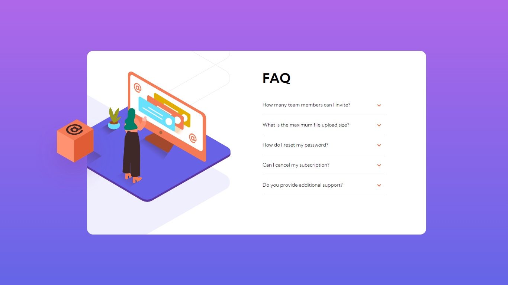

<h1>👨‍💻Front-end Mentor</h1>
<h3><i>Desafio (FAQ accordion card main)</i></h3>

<h4>
<a href="https://yohan-marques.github.io/FAQ-accordion-card-main/">Projeto On 🔛</a>
</h4>

<h2>Sobre o projeto</h2>

Projeto desenvolvido com a finalidade de apredizagem e construção na parte de <strong>FRONT-END,</strong> visivel tanto em <i>Desktop</i> quanto <i>Mobile. </i> Tendo em si uma pequena interação com o usuário por  meio de <strong>JavaScript.</strong>
 

<h3>Layout Desktop</h3>

<h3>Layout Mobile</h3>

<h2>Tecnologias Utilizadas</h2>

- [x] HTML5
- [x] CSS3
- [x] JavaScript

